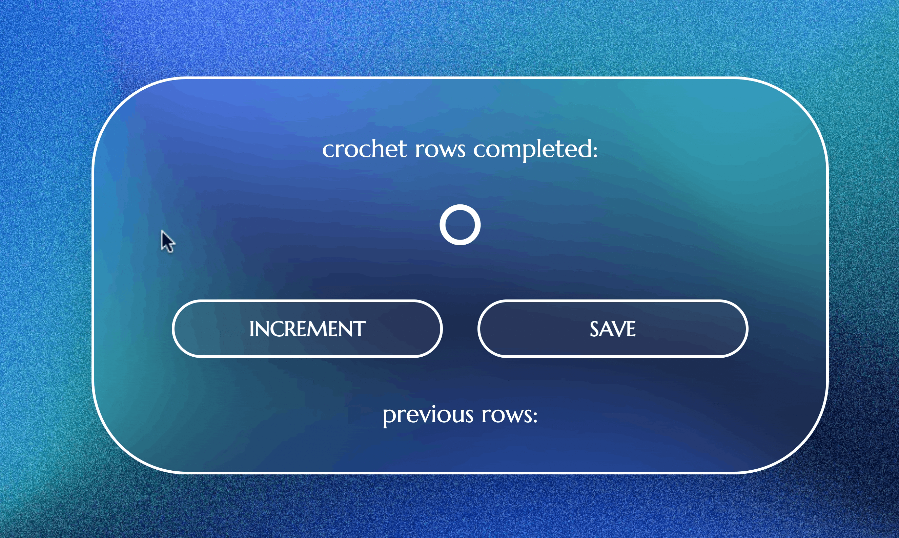

# Crochet row counter

Crochet row counter is a basic tool that allows you to keep track of your crochet rows.
Counter resets with every row finished and saved, it also keeps the your previous entries if you're working in longer loops. 

# Netlify Adress

https://crochet-row-counter.netlify.app

# Created with 
- HTML5
- CSS3
- JavaScript ES2023

#
Made as a part of Scrimba course.

